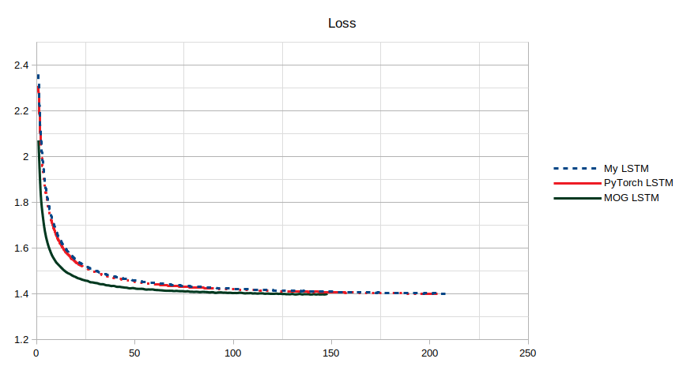

# Mogrifier LSTM

This repository implements an LSTM from scratch in PyTorch (allowing PyTorch to handle the backpropagation step) and then attempts to replicate the [Mogrifier LSTM paper](https://arxiv.org/abs/1909.01792). The code can be run locally or in Google Colaboratory.

**Update:** The code for the mogrifier LSTM has been posted. It's a bit hard to grok due to way they parameterized their neural network model experiments, so I will attempt to update my own implementation for correctness, but if you want to go to the source, [look here](https://github.com/deepmind/lamb)

## Mogrifier LSTM Results

I tested the Mogrifier LSTM on a basic RNN text prediction problem using the Brown corpus dataset (more info in the notebook) and saw **earlier convergence results and slightly better validation and training loss results** when comparing the Mogrifier LSTM to a vanilla LSTM. To further verify these results, we need to test against more datasets and more neural network architectures. Checkpoints and metrics have been saved for each LSTM type per epoch (see run folder); I didn't CM the tensorboard event logs as they are huge, but you can get most of the same information just looking at the JSON metric files. A summary of the results I got can be seen below:



### My LSTM (made from scratch; slow)

*automatic early stopping never reached criteria for stop in 210 epochs, though may have been close*
<pre><code>
 'best_epoch': 207,
 'training_epochs': 209,
 'epoch': 209,
 'training_loss': 1.3781935724280996,
 'training_cpu_memory_MB': 2750.236,
 'training_gpu_0_memory_MB': 952,
 'validation_loss': 1.401858257619958,
 'best_validation_loss': 1.4012448003417568}
</code></pre>

### Official PyTorch LSTM (has optimized performance)

*automatic early stopping used*
<pre><code>
 'best_epoch': 197,
 'training_epochs': 203,
 'epoch': 203,
 'training_loss': 1.3790437656746815,
 'training_cpu_memory_MB': 2751.964,
 'training_gpu_0_memory_MB': 1014,
 'validation_loss': 1.4007186230860258,
 'best_validation_loss': 1.4002491518070823
</code></pre>

### Mogrifier LSTM (used my LSTM and then added improvements)

*automatic early stopping used*
<pre><code>
 'best_epoch': 141
 'training_epochs': 147,
 'epoch': 147,
 'training_loss': 1.3751222530060265,
 'training_cpu_memory_MB': 2771.636,
 'training_gpu_0_memory_MB': 1115,
 'validation_loss': 1.401227615381542,
 'best_validation_loss': 1.3973440904366343
</code></pre>

*Note on Mogrifier results: The Mogrifier LSTM paper claimed they would release their own code, but this has yet to happen (paper was released in September 2019). When that code is available, it should be at https://github.com/deepmind/lamb .*

# Running the Code Yourself

There are a couple of ways to run the code in this repository. One method is to run in a Jupyter notebook locally. The other method is to upload the notebook file to Google Colaboratory and run from there. The second method is convenient, but may not give you all the training time you really want. Instructions for both methods are found below.

## Local Install

Recommended you use Python `3.7`.
You will need to make sure that your virtualenv setup is of the correct version of python.
We will be using *PyTorch*.

Please see below for executing a virtual environment.

```shell
cd MogrifierLSTM
pip3 install virtualenv # If you didn't install it
virtualenv -p $(which python3) ./venv_lstm
source ./venv_lstm/bin/activate

# Install dependencies
pip3 install -r requirements.txt

# View the notebook

# Deactivate the virtual environment when you are done
deactivate
```

### Working with IPython Notebook

To view the notebook, simply run the following command to start an ipython kernel.

```shell
# add your virtual environment to jupyter notebook
python -m ipykernel install --user --name=venv_lstm

# port is only needed if you want to work on more than one notebook
jupyter notebook --port=<your_port>

```

and then work on the `MogrifierLSTM.ipynb` notebook.
Check the python environment you are using on the top right corner.
If the name of environment doesn't match, change it to your virtual environment in "Kernel>Change kernel".

### Viewing the results in tensorboard

After running your own training runs and collecting all your event logs, you can see the results in tensorboard by running the following command in a terminal and then viewing the link provided in your browser.

```shell
#replace "run" with whatever directory you have saved 
#your runs to (if different than what was set in the notebook) 
tensorboard --logdir run
```

## Cloud Install (Google Colaboratory)

1. Head over to [Google Colab](https://colab.research.google.com/). It is recommended that you switch to a GPU notebook as things will usually run a little faster that way. There are instructions for this on the colaboratory site.
2. Download the .ipynb file in this repository
3. Upload that file to Google Colabatory and run from there!

**Note: Google Colaboratory has time limits for their systems, so you may not be able to fully train the Mogrifier LSTM on their system without some special effort.**
